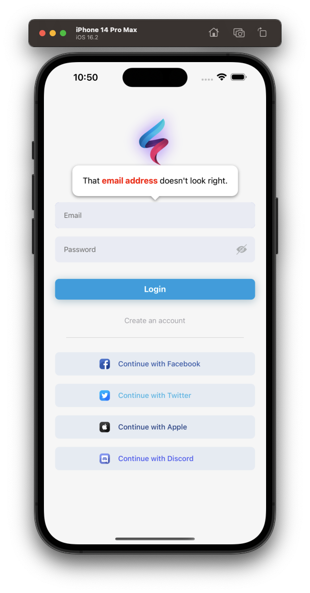
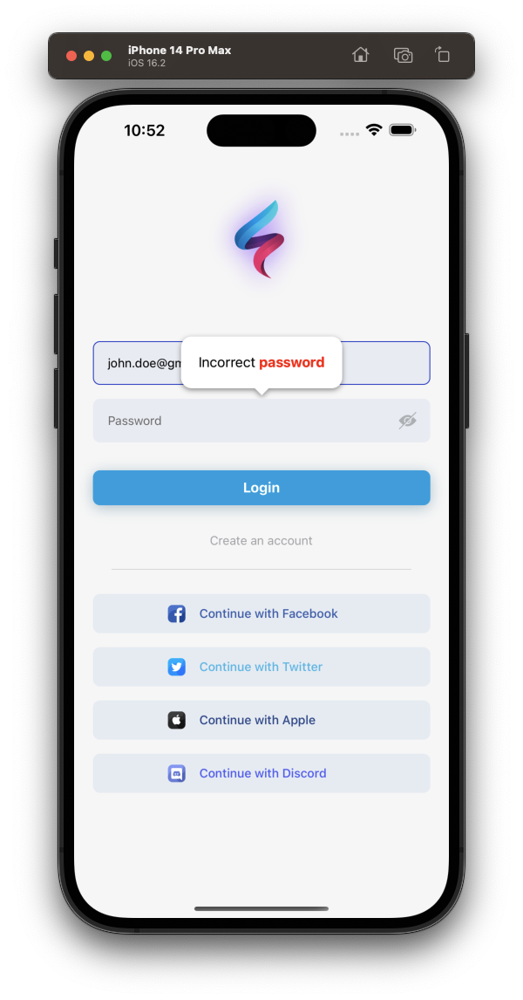

[](https://github.com/WrathChaos/react-native-tooltip-2)

[](https://github.com/WrathChaos/react-native-tooltip-2)

[](https://www.npmjs.com/package/react-native-tooltip-2)
[](https://www.npmjs.com/package/react-native-tooltip-2)

[](https://opensource.org/licenses/MIT)
[](https://github.com/prettier/prettier)

<p align="center">
  
  
</p>

# Installation

Add the dependency:

```bash
npm i react-native-tooltip-2
```

# Usage

## Import

```tsx
import Tooltip from "react-native-tooltip-2";
```

## Fundamental Usage

```tsx
 <Tooltip
    isVisible={toolTipVisible}
    content={<Text>Check this out!</Text>}
    placement={Placement.TOP}
    onClose={() => setToolTipVisible(false)}>
    <Pressable
        style={styles.button}
        onPress={() => setToolTipVisible(true)}>
        <Text>Press me</Text>
    </Pressable>
</Tooltip>
```

## Example Project 😍

You can checkout the example project 🥰

Simply run

- `npm i && npx pod-install`
- `react-native run-ios/android`

should work of the example project.

### How it works

The tooltip wraps an element _in place_ in your React Native rendering. When it renders, it measures the location of the element, using React Native's
[measure](https://facebook.github.io/react-native/docs/direct-manipulation.html#measurecallback). When the tooltip is displayed, it renders a _copy_ of the wrapped element positioned absolutely on the screen at the coordinates returned after measuring ([see `TooltipChildrenContext` below](#tooltipchildrencontext) if you need to tell the difference between the _copy_ and the _original_ element). This allows you to touch the element in the tooltip modal rendered above your current screen.

### Props

| Prop name        | Type             | Default value                          | Description                                                                                                                                                                                                    |
| ---------------- | ---------------- | -------------------------------------- | -------------------------------------------------------------------------------------------------------------------------------------------------------------------------------------------------------------- |
| accessible | bool| true | Set this to `false` if you do not want the root touchable element to be accessible. [See docs on accessible here](https://reactnative.dev/docs/accessibility#accessibility-properties)
| allowChildInteraction | bool| true | By default, the user can touch and interact with the child element. When this prop is false, the user cannot interact with the child element while the tooltip is visible. |
| arrowSize        | `Size`           | { width: 16, height: 8 }               | The dimensions of the arrow on the bubble pointing to the highlighted element                                                                                                                                  |
| backgroundColor  | string           | 'rgba(0,0,0,0.5)'                      | Color of the fullscreen background beneath the tooltip. **_Overrides_** the `backgroundStyle` prop                                                                                                             |
| childContentSpacing | number | 4 | The distance between the tooltip-rendered child and the arrow pointing to it |
| closeOnChildInteraction | bool | true | When child interaction is allowed, this prop determines if `onClose` should be called when the user interacts with the child element. Default is true (usually means the tooltip will dismiss once the user touches the element highlighted) |
| closeOnContentInteraction | bool | true | this prop determines if `onClose` should be called when the user interacts with the content element. Default is true (usually means the tooltip will dismiss once the user touches the content element) |
| content          | function/Element | `<View />`                             | This is the view displayed in the tooltip popover bubble                                                                                                                                                       |
| displayInsets | object | { top: 24, bottom: 24, left: 24, right: 24 } | The number of pixels to inset the tooltip on the screen (think of it like padding). The tooltip bubble should never render outside of these insets, so you may need to adjust your `content` accordingly |
| disableShadow | bool | false | When true, tooltips will not appear elevated. Disabling shadows will remove the warning: `RCTView has a shadow set but cannot calculate shadow efficiently` on IOS devices. |
| isVisible        | bool             | false                                  | When true, tooltip is displayed                                                                                                                                                                                |                                                            |
| onClose          | function         | null                                   | Callback fired when the user taps the tooltip background overlay                                                                                                                                               |
| placement        | string           | "top" \| "center"                                  | Where to position the tooltip - options: `top, bottom, left, right, center`. Default is `top` for tooltips rendered with children Default is `center` for tooltips rendered without children. <br><br>NOTE: `center` is only available with a childless placement, and the content will be centered within the bounds defined by the `displayInsets`. |
| showChildInTooltip | bool | true | Set this to `false` if you do NOT want to display the child alongside the tooltip when the tooltip is visible |
| supportedOrientations | array | ["portrait", "landscape"] | This prop allows you to control the supported orientations the tooltip modal can be displayed. It correlates directly with [the prop for React Native's Modal component](https://facebook.github.io/react-native/docs/modal#supportedorientations) (has no effect if `useReactNativeModal` is false) |
| topAdjustment          | number         | 0                                   | Value which provides additional vertical offest for the child element displayed in a tooltip. Commonly set to: `Platform.OS === 'android' ? -StatusBar.currentHeight : 0` due to an issue with React Native's measure function on Android
| horizontalAdjustment          | number         | 0                                   | Value which provides additional horizontal offest for the child element displayed in a tooltip. This is useful for adjusting the horizontal positioning of a highlighted child element if needed
| useInteractionManager | bool | false | Set this to true if you want the tooltip to wait to become visible until the callback for `InteractionManager.runAfterInteractions` is executed. Can be useful if you need to wait for navigation transitions to complete, etc. [See docs on InteractionManager here](https://facebook.github.io/react-native/docs/interactionmanager)
| useReactNativeModal | bool| true | By default, this library uses a `<Modal>` component from React Native. If you need to disable this, and simply render an absolutely positioned full-screen view, set `useReactNativeModal={false}`. This is especially useful if you desire to render a Tooltip while you have a different `Modal` rendered.

### Style Props

The tooltip styles should work out-of-the-box for most use cases, however should you need you can customize the styles of the tooltip using these props.

| Prop name            | Effect                                                                          |
| -------------------- | ------------------------------------------------------------------------------- |
| arrowStyle           | Styles the triangle that points to the called out element                       |
| backgroundStyle      | Styles the overlay view that sits behind the tooltip, but over the current view |
| childrenWrapperStyle | Styles the view that wraps cloned children                                      |
| contentStyle         | Styles the content wrapper that surrounds the `content` element                 |
| tooltipStyle         | Styles the tooltip that wraps the arrow and content elements                    |

### Class definitions for props

* `Size` is an object with properties: `{ width: number, height: number }`

### TooltipChildrenContext

[React Context](https://reactjs.org/docs/context.html) that can be used to distinguish "real" children rendered inside parent's layout from their copies rendered inside tooltip's modal. The duplicate child rendered in the tooltip modal is wrapped in a Context.Provider which provides object with prop `tooltipDuplicate` set to `true`, so informed decisions may be made, if necessary, based on where the child rendered.

```js
import Tooltip, { TooltipChildrenContext } from 'react-native-walkthrough-tooltip';
...
<Tooltip>
  <ComponentA />
  <ComponentB>
    <TooltipChildrenContext.Consumer>
      {({ tooltipDuplicate }) => (
        // Will only assign a ref to the original component
        <FlatList {...(!tooltipDuplicate && { ref: this.listRef })} />
      )}
    </TooltipChildrenContext.Consumer>
  </ComponentB>
</Tooltip>
```

## Credits

This library is a fork of [react-native-walkthrough-tooltip](https://github.com/jasongaare/react-native-walkthrough-tooltip)
- Full typescript re-written
- Much better types and props
- Better customizability

## Future Plans

- [x] ~~LICENSE~~
- [ ] Code separation rely on **separation of concern(SoC)**
- [ ] Code cleanup and refactoring
- [ ] Better README and documentation
- [ ] Write an article about the lib on Medium


## Author

FreakyCoder, kurayogun@gmail.com

## License

React Native Tooltip 2 is available under the MIT license. See the LICENSE file for more info.
